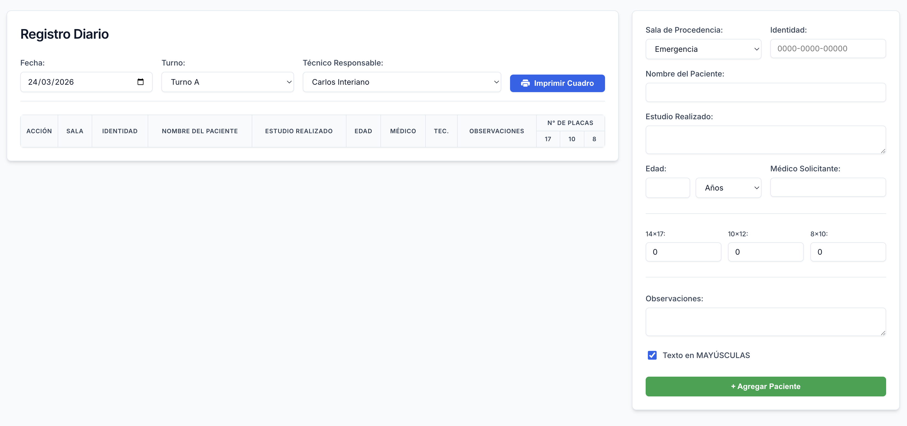

# Generador de Reportes de Imagenología

> **Herramienta web autónoma para la creación, tabulación e impresión del registro diario de pacientes del Departamento de Imagenología del Hospital Dr. Juan Manuel Gálvez.**

## 📌 Propósito

A diferencia de un sistema de base de datos o registro electrónico tradicional (donde se almacenan los datos a largo plazo), esta aplicación es una **utilidad de formato en tiempo real**. Su único objetivo es facilitar al técnico de turno la captura rápida de la información de los pacientes y generar un cuadro físico perfectamente tabulado para imprimir y archivar. 

Al cerrar la pestaña del navegador, **ningún dato se guarda ni se almacena**, garantizando así una herramienta liviana, libre de instalaciones y completamente segura respecto a la privacidad del paciente.

## ✨ Funcionalidades Principales

* **Interfaz Moderna de Dos Paneles (Split-Layout)**: El área de trabajo se divide inteligentemente entre un formulario lateral (30%) de captura rápida y un panel de previsualización (70%) para los pacientes agregados.
* **Control Inteligente de Texto**: Opción intuitiva para forzar todo el texto capturado a letras MAYÚSCULAS o mantener el formato estándar (Letra Capital), agilizando el llenado libre.
* **Flujo de Trabajo Ininterrumpido**: El cursor regresa automáticamente al primer campo importante (*Identidad*) tras ingresar a un paciente, permitiendo captar decenas de personas sin tener que volver a usar el ratón.
* **Formato de Impresión Calibrado Milimétricamente**: El motor interno manipula el CSS de impresión (`@media print`) para generar una página perfecta de **330mm x 216mm** exactos, ocultando menús, botones interactivos y reposicionando elementos de encabezado oficial.
* **Automatización de Encabezados**: Inyección de "Fecha", "Turno" y "Técnico" directamente en los encabezados del documento oficial al presionar el botón imprimir.

## 🛠 Tecnología

El proyecto fue desarrollado usando un ecosistema **100% Vanilla (Puro)**, lo que resulta en un archivo base consolidado (`index.html`) que pesa escasos kilobytes, no requiere instalación, no usa frameworks que puedan desactualizarse y puede ejecutarse literalmente en cualquier dispositivo con un navegador sin internet.

1. **HTML5**: Estructura semántica simple.
2. **CSS3 Puro (Diseño "Tailwind-like")**: Utilizando variables CSS nativas (`:root`), Flexbox y CSS Grid. Todo el diseño responsivo, las sombras suaves, esquinas redondeadas y colores de estado interactivos fueron escritos a mano basándose en principios modernos de UI/UX, simulando un framework.
3. **JavaScript (ES6)**: Encargado de la lógica de matrices temporales, la inserción reactiva de filas al Document Object Model (DOM) y la comunicación nativa de la función `window.print()`.

## 🚀 Cómo Empezar

1. **No requiere instalación.** Simplemente da doble clic sobre el archivo `index.html`.
2. El sistema se abrirá en tu navegador web predeterminado (Google Chrome, Firefox, Safari o Microsoft Edge).
3. Llena la barra de opciones iniciales (Fecha, Turno, y Técnico Responsable).
4. Captura al paciente y presiona **+ Agregar Paciente**.
5. Cuando el turno termine o la página se haya llenado, haz clic en **🖨️ Imprimir Cuadro**, ajusta tu impresora física para que coincida con el margen y selecciona "Imprimir".
